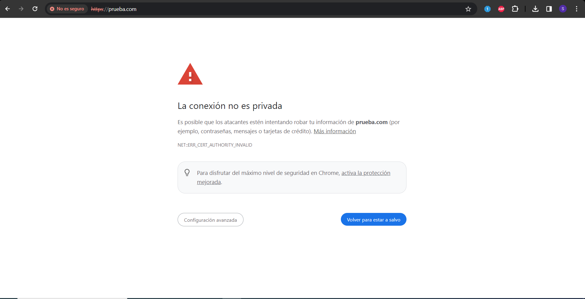
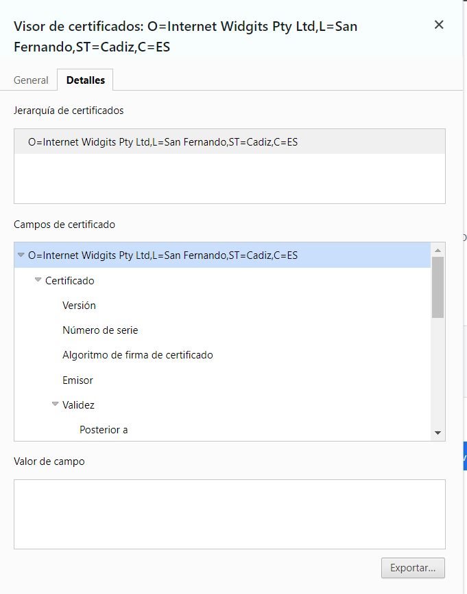
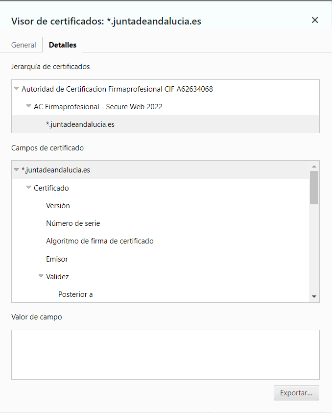
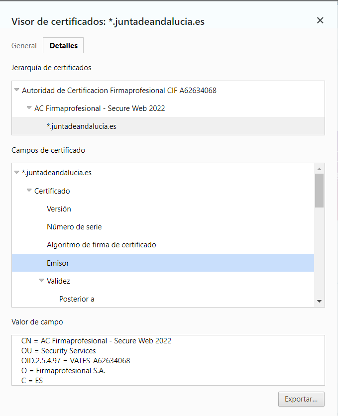
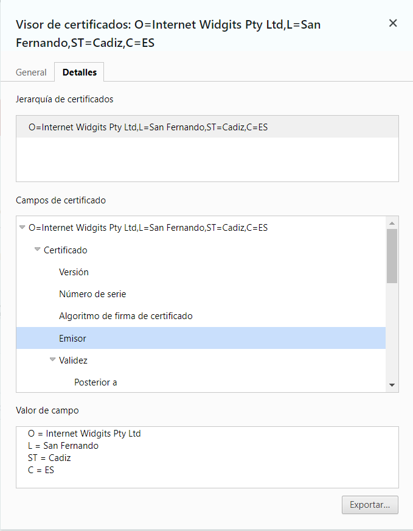
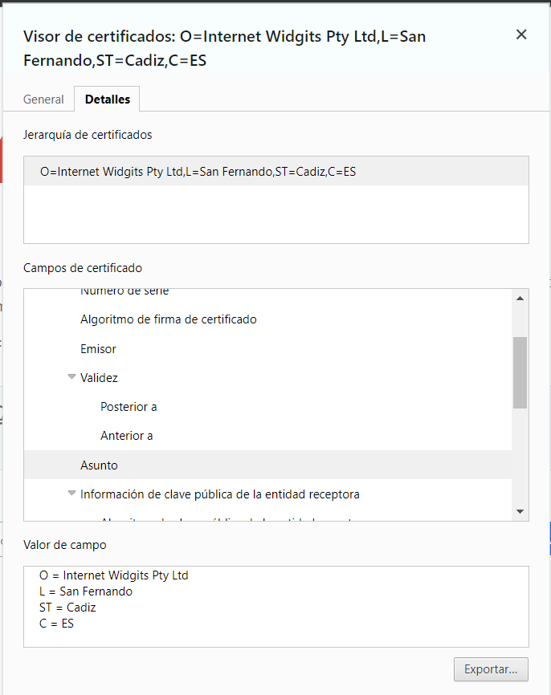
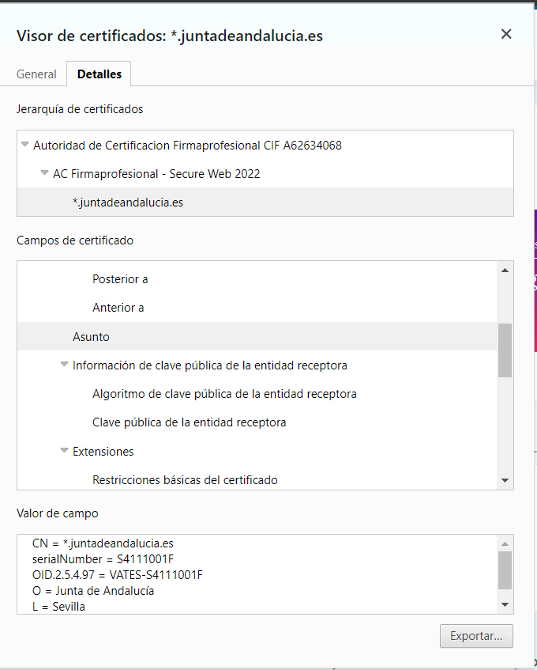
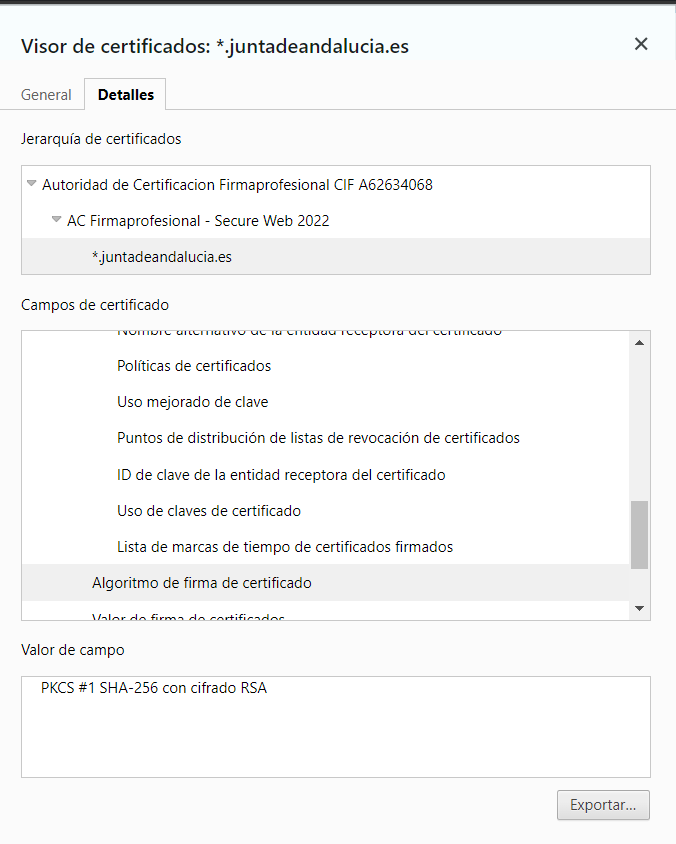
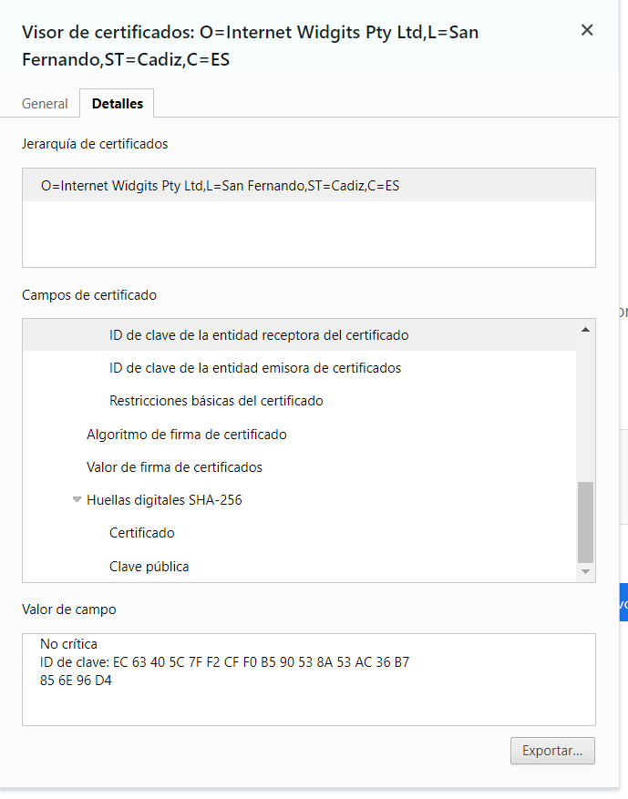

# Parte 2

# Vía Simulada

1. En la máquina virtual usada en la parte 1, instala un servidor web y prepáralo para servir una página de prueba. Genera un certificado autofirmado y configura HTTPS. Obtén una captura del error que proporciona el navegador y otra de los datos de tu certificado en el mismo.

Tras instalar el servidor web de Apache y generar un certificado autofirmado y configurar el HTTPS, añadiendo algunos datos al certificado. Tras eso, vamos a añadir la pagina web de nuestra IP al archivo de Windows host que se encuentra en C:\Windows\System32\drivers\etc , y ahora  si vamos a la página web, nos saldrá lo siguiente:

Y ahora si vemos los datos de el certificado, podemos ver algunos datos que he puesto:

1. Ahora, acude a un sitio web verificado y obtén una captura de los datos de su certificado. Analiza y compara las diferencias entre ambos en un documento.
    
    La página web que voy a coger va a ser la de el aula virtual, o mejor dicho, la de la juntadeandalucia.es:
    
    
    
    De las diferencias, de el certificado son las siguientes: 
    
    - Mucha información en el emisor en comparación con el creado. Debido a que lo ha llevado un página especializada en Certificados y en seguridad, mientras que el mío, lo he creado yo mismo
    
    
    
    
    
    - Más información sobre el asunto , mostrando el Serial Number, OID, en comparación con el mío, que solo aparece lo mismo que puse en el emisor.

- Otra de las mayores diferencias que hay, es que el certificado de la juntadeandalucia.es, tiene mas  opciones y mas información con respecto al que he creado recientemente. Una de las diferencias, es que el de la junta, tendrá mas seguridad y se mostrará menos en comparación con el nuestro.

