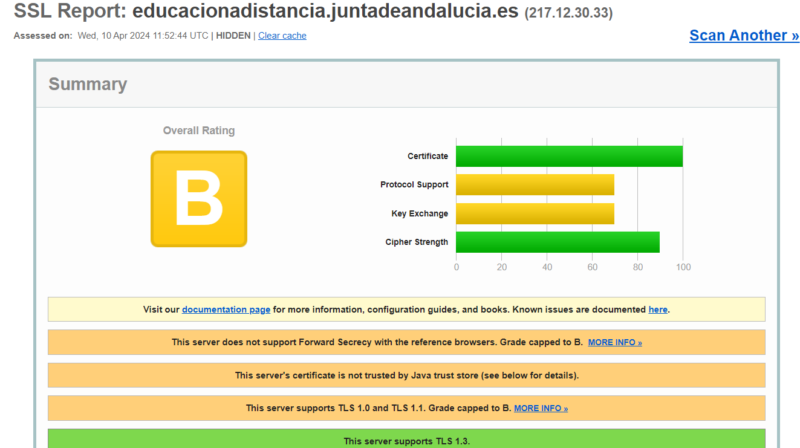
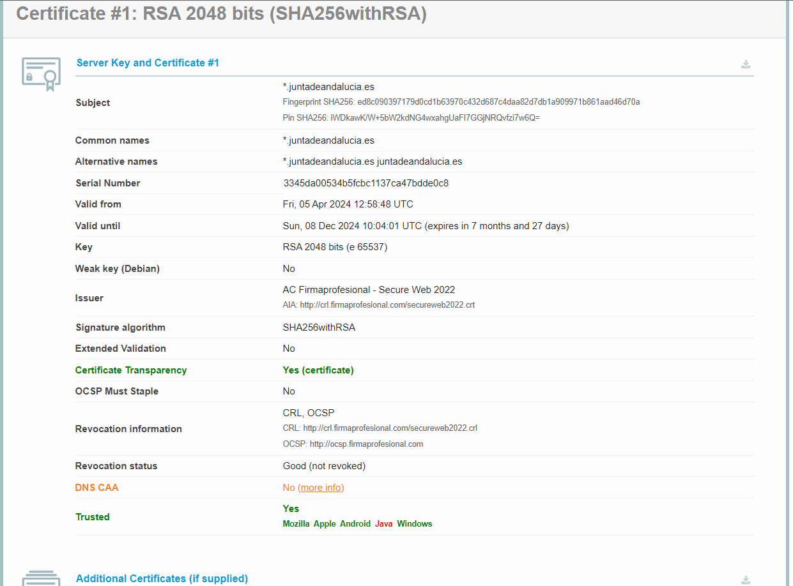
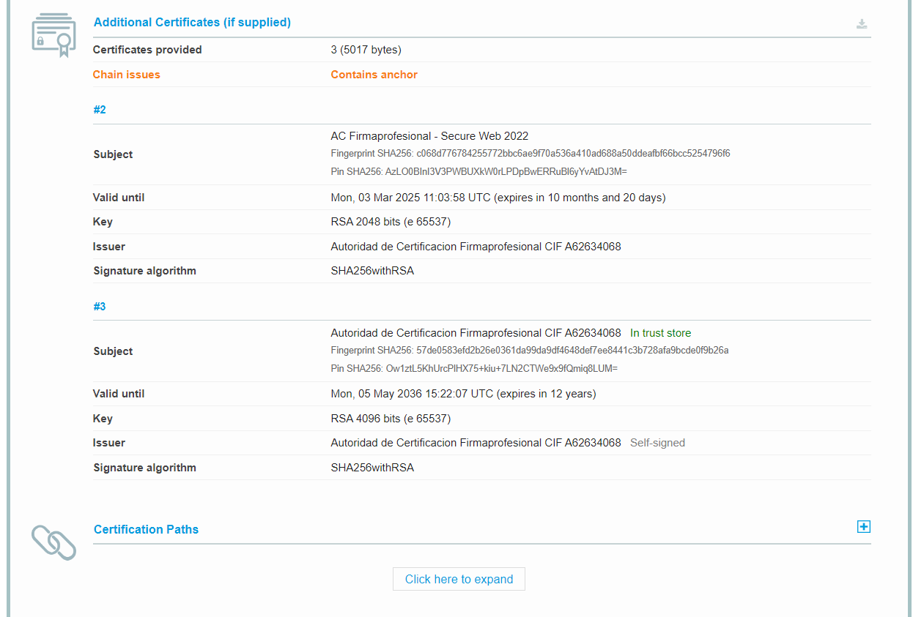
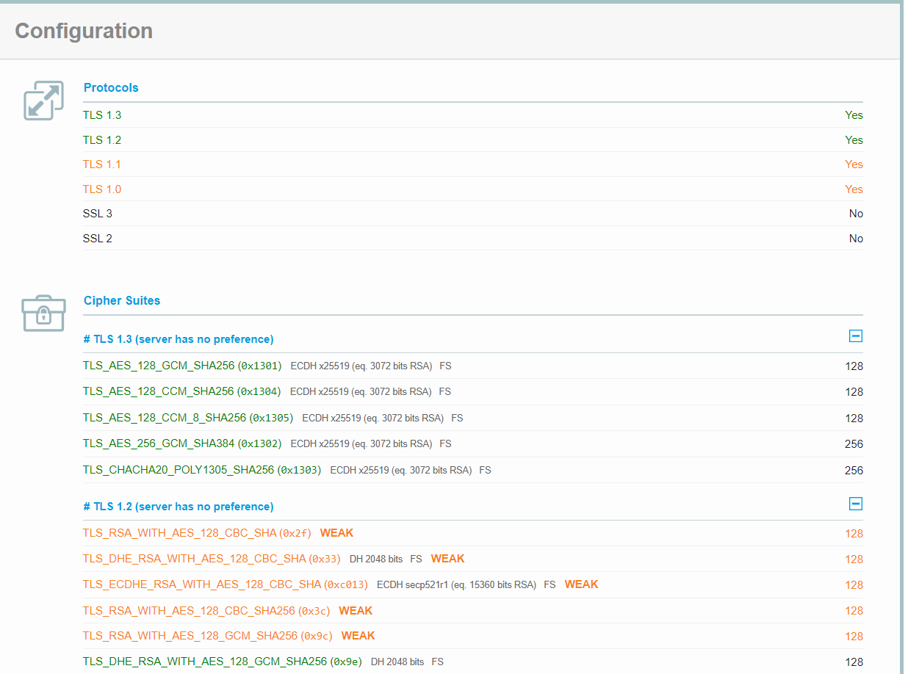
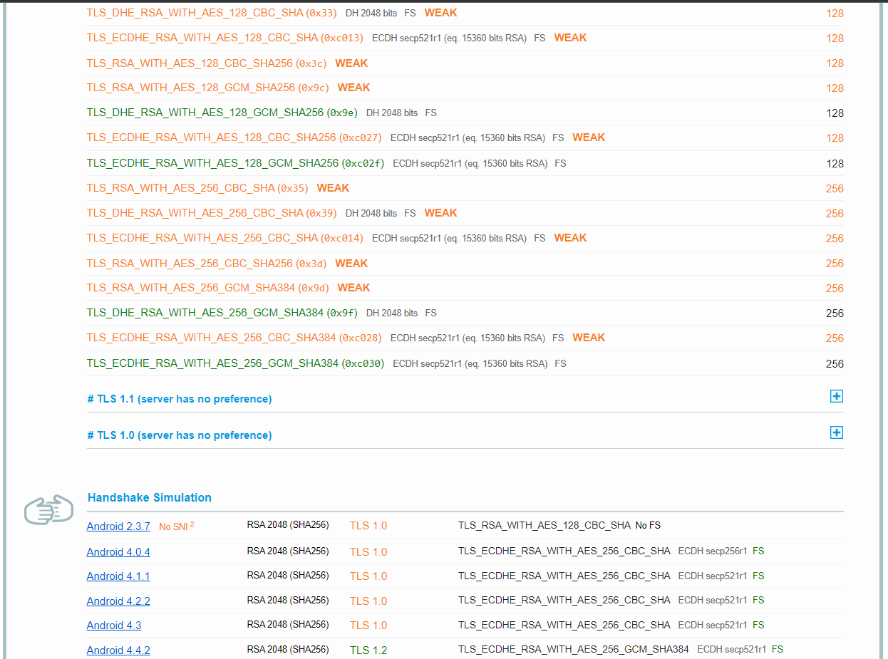

# Parte 3

# Vía Simulada

1. Analiza el certificado válido del sitio web de la parte 2 en un servicio como [SSL Labs](https://www.ssllabs.com/ssltest/) y explica, en base a los resultados, los motivos que llevan a verificarlo como válido. Luego, localiza tres certificados erróneos de [diferente tipo](https://www.redeszone.net/tutoriales/redes-cable/evitar-errores-ssl-navegador/) en sitios web. Analízalos también usando un servicio y explica los motivos que llevan a verificarlos como no válidos.
    
    

Puse la página web de la junta de Andalucía, y da la siguiente respuesta:

Vemos que tiene una B, debido a los problemas de debilidad que tiene con los codigos de SHA y en versiones de algunos dispositivos como de Android antiguos, algunos Windows. Aparte de tener algún que otro problema con algunas navegadores.

En tema de cifrado de seguridad y certificado (Que para mi son los aspectos más importantes), tiene una buena seguridad, al punto que alcanza mas del 80%, ero en tema de support a navegadores, dispositivos o Sistemas Operativos, se tendría que mejorar en general.

Por no tener Foward Secrecy con los navegadores referencia, tu rango va a estar en B y no subirá más, al menos que remedie este problema.

- Certificados Inválidos:
    - **ERR_SSL_WEAK_EPHEMERAL_DH_KEY →** Este error ocurre debido a que el código de seguridad esta obsoleto o esta mal configurado. Para remediar este problema, se puede actualizar el servidor para que sea compatible con ECDHE y desactiva DHE. Si ECDH no está disponible, puedes desactivar todos los conjuntos de algoritmo de cifrado DHE y utilizar RSA simple.
    - **NET::ERR_CERT_AUTHORITY_INVALID →** Este error aparecerá cuando haya expirado la fecha de caducidad del instalado en los servidores del sitto web. Por lo que, para resoverlo, se tiene que renovar su certificado. Muchas veces, Google puede ponerlo, aunque no sea verdad. Esto puede pasar debido a que la configuración de la fecha y hora es incorrecta y se establece una fecha futura posterior a la fecha de vencimiento del certificado instalado. Para ello, tendremos que verificar bien la fecha y la hora en la configuración del sistema de sus dispositivos.
    - **ERR_SSL_VERSION_OR_CIPHER_MISMATCH →** Si sale este error, es debido a que usa una versión obsoleta de TLS o un conjunto de cifrado que con los navegadores no son compatibles. Para remediarlo, hay que actualizar la versión TLS de el certificado SSL y el conjunto de cifrado para poder arreglar el error.